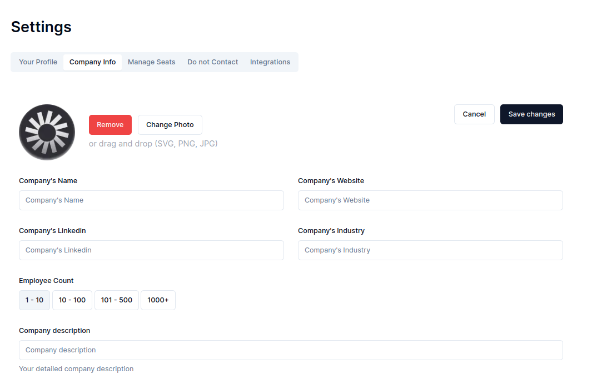

# Valley Dashboard

Valley Dashboard Challenge Built with Next.js(Pages Router), shadcn, tailwind, zod, react-hook-form and typescript.

## Description

The primary content is displayed within a tab labeled "Company Info" (https://ui.shadcn.com/docs/components/tabs).

### Form and Buttons

All content outside the tab navigation and heading is wrapped in a form. The "Save changes" button submits the form, while the "Cancel" button clears current form values. While a "Cancel" button typically returns to the previous page, this functionality wasn't requested but I think it makes a great addition.

### Form Validation

Form validation is implemented using [react hook form](https://react-hook-form.com/) and [zod](https://zod.dev/).

### Responsiveness

The layout adapts to different screen sizes:

- **Mobile:**
  - The navigation menu becomes scrollable.
  - Each input is placed on a separate row.
  - "Save changes" and "Cancel" buttons occupy an entire row for better usability.
- **Wider Screens:** A maximum width is set for the main element to prevent content from stretching beyond a reasonable width.

### Styling Constraints

Due to constraints, no additional styling is applied to the existing shadcn components. However, exceptions were made for:

- **Buttons:** "Save changes" and "Cancel" buttons are adjusted to occupy an entire row on mobile.
- **TabList:** The default `items-center` and `justify-center` styles are removed from the `TabList` component.

### Future Enhancements

To further enhance the visual appeal, the following design elements could be implemented:

- Rounding the corners of the employee toggle buttons.
- Applying appropriate background colors to the toggle buttons when selected.
- Adding a background gradient to the "Save changes" and "Remove" buttons.
